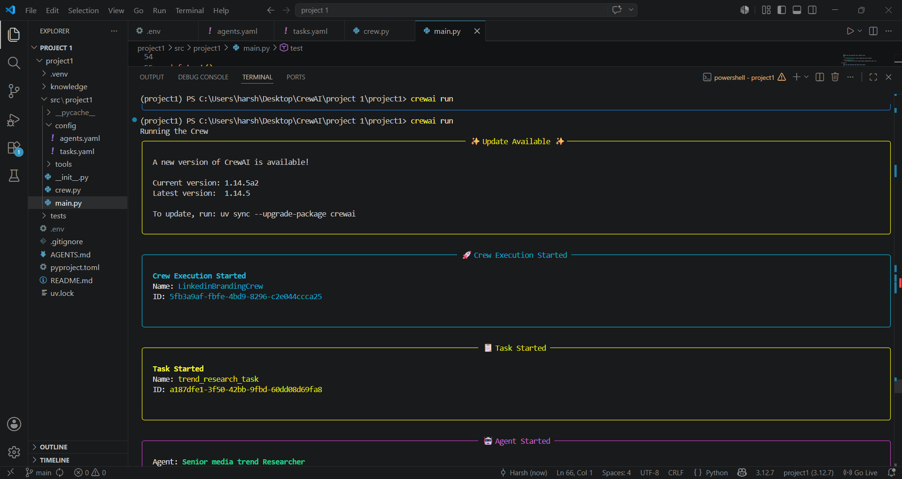

# 🚀 Autonomous LinkedIn Branding and Trend Engine

An automated multi-agent AI system built using the **CrewAI** framework and powered by **Groq API (Llama-3.3-70b-versatile)**. This project automates social media marketing by analyzing viral trends and drafting high-converting, professional LinkedIn posts.

---

## 🤖 AI Agents Workflow

1. **Social Media Trend Researcher:** Scans and extracts the top 5 latest trends regarding the specified topic.
2. **LinkedIn Content Creator:** Crafts an engaging, emoji-rich post under 300 words with a strong hook and CTA.
3. **Hashtag & SEO Specialist:** Generates 10 optimized hashtags to maximize post reach and visibility.

---

# 📸 Project Demo & Output

# 1. Terminal Execution Demo (Video)
Watch the multi-agent system in action, running trend research and content generation in real-time:

[Click to Play Video](./demo.mp4)

# 2. Final Generated Output (Screenshot)
Below is the screenshot of the autonomous agents successfully executing and generating the LinkedIn post inside the VS Code terminal:


(ss2.png)
(ss3.png)
(ss4.png)
(ss5.png)
(ss6.png)
(ss7.png)
---

## 🛠️ Setup & Installation Instructions

### 1. Prerequisites
Ensure you have Python >= 3.10 installed on your system. This project uses `uv` for lightning-fast dependency management.

### 2. Environment Setup
Create a `.env` file in the root directory and add your Groq credentials securely:
```env
OPENAI_API_KEY=your_groq_api_key_here
OPENAI_BASE_URL=[https://api.groq.com/openai/v1](https://api.groq.com/openai/v1)
OPENAI_MODEL_NAME=llama-3.3-70b-versatile