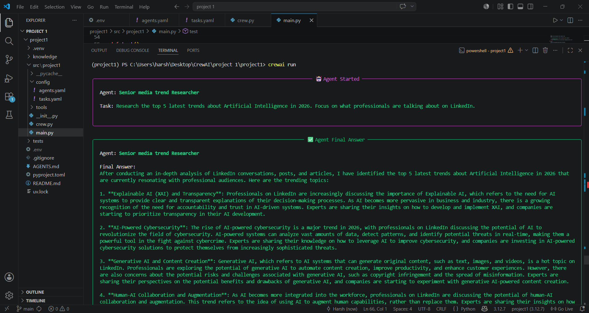
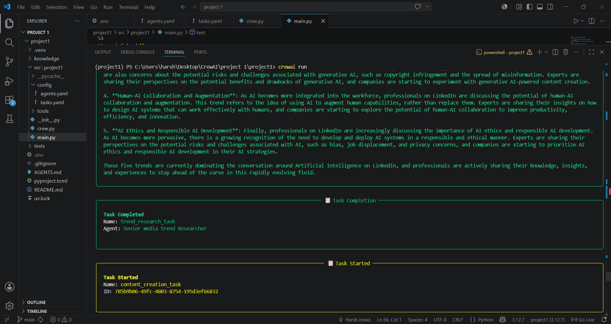
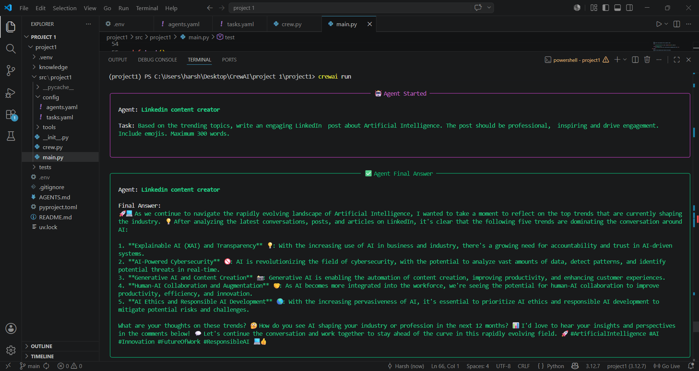
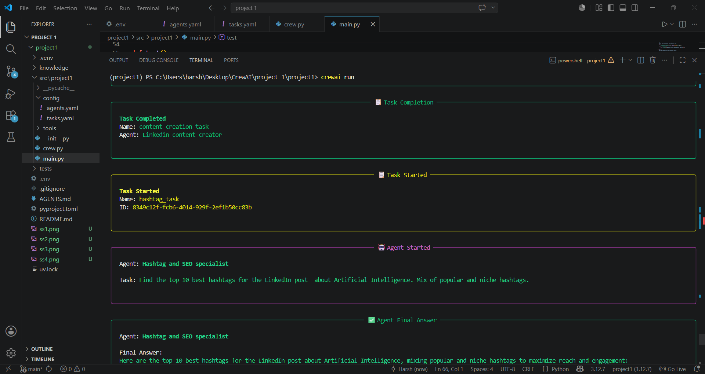
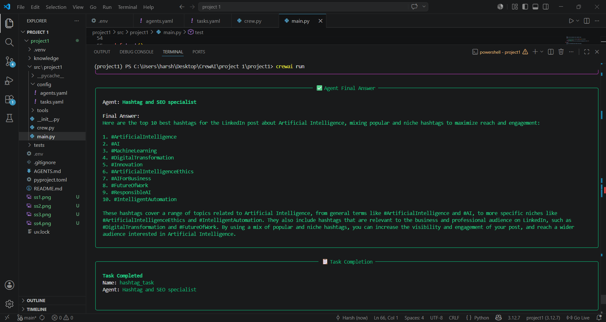
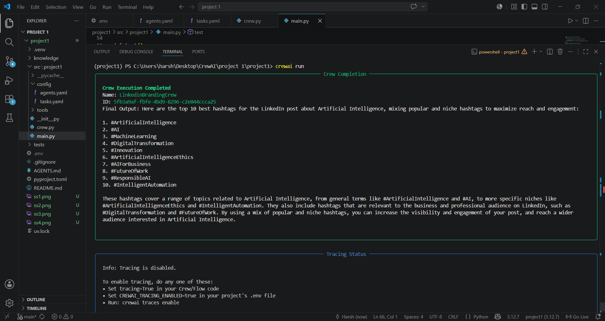

# 🚀 Autonomous LinkedIn Branding and Trend Engine

An automated multi-agent AI system built using the advanced **CrewAI** framework and powered by the blazing-fast **Groq API (Llama-3.3-70b-versatile)**. This project automates social media marketing by analyzing current viral tech trends and drafting high-converting, professional LinkedIn posts completely autonomously.

---

## 🤖 AI Agents Workflow & Architecture

The system deploys a crew of 3 specialized autonomous agents that work collaboratively:

1. **Social Media Trend Researcher:** Scans and extracts the top 5 latest trends and insights regarding the specified technical topic.
2. **LinkedIn Content Creator:** Takes the researched trends and crafts an engaging, emoji-rich professional post under 300 words with a strong hook and clear Call-to-Action (CTA).
3. **Hashtag & SEO Specialist:** Analyzes the final draft and generates 10 optimized, high-reach hashtags to maximize visibility on the LinkedIn algorithm.

---

## 📸 Project Demo & Step-by-Step Execution

### 1. Real-Time Execution Demo (Video)
Watch the multi-agent system in action, running trends research, agent collaboration, and content generation in real-time inside the terminal:

<video src="demo.mp4" controls="controls" style="max-width:100%";git></video>

---
### 2. Step-by-Step Terminal Outputs (Screenshots)
Below is the complete visual walkthrough of the autonomous agents successfully executing their tasks step-by-step:

#### 🔹 Step 1: Initializing the Crew & Starting Trend Research


#### 🔹 Step 2: Agent Kickoff & Analyzing Topics


#### 🔹 Step 3: Trend Researcher Extracting Key Insights


#### 🔹 Step 4: Passing Insights to Content Creator Agent


#### 🔹 Step 5: Content Creator Crafting the LinkedIn Post Draft


#### 🔹 Step 6: Hashtag Specialist Optimizing SEO & Tags


#### 🔹 Step 7: Final Viral-Ready Output Print


---

## 🛠️ Setup & Installation Instructions

### 1. Prerequisites
Ensure you have Python >= 3.10 and < 3.14 installed on your system. This project utilizes `uv` for lightning-fast dependency and package management.

### 2. Installation
First, open your terminal inside the project directory and install `uv` (if you haven't already):
```bash
pip install uv
